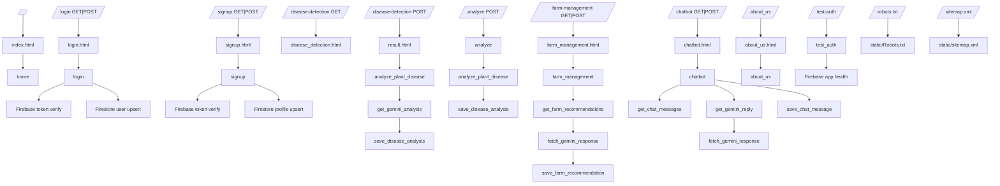

# GrowMate Architecture

## Route to Template to Function Map

## Data Persistence

- Auth identity source: Firebase Auth ID tokens
- User profile store: Firestore `users/{uid}`
- Chat history store: Firestore `users/{uid}/chat_sessions/{sessionId}/messages/{messageId}`
- Disease analysis store: Firestore `users/{uid}/analysis_history/{id}`
- Farm recommendation store: Firestore `users/{uid}/farm_recommendations/{id}`

## Legacy Archive

Legacy paths moved to `legacy_backup/` for safe rollback.
